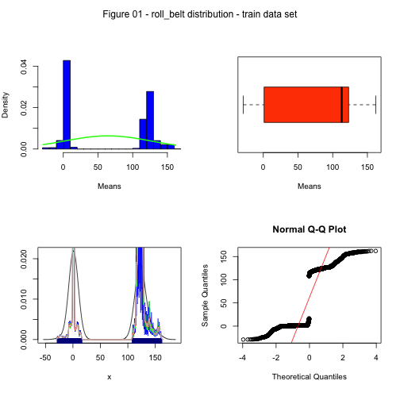

# Executive Summary

Using devices such as Jawbone Up, Nike FuelBand, and Fitbit it is now possible 
to collect a large amount of data about personal activity relatively 
inexpensively. 

These type of devices are part of the quantified self movement – a group of 
enthusiasts who take measurements about themselves regularly to improve their
health, to find patterns in their behavior, or because they are tech geeks. 
One thing that people regularly do is quantify how much of a particular activity 
they do, but they rarely quantify how well they do it. 

In this project, your goal will be to use data from accelerometers on the belt,
forearm, arm, and dumbell of 6 participants. They were asked to perform barbell
lifts correctly and incorrectly in 5 different ways. More information is 
available from the website here: http://groupware.les.inf.puc-rio.br/har 
(see the section on the Weight Lifting Exercise Dataset). 

### Libraries
The following libraries were used throughout the code.

```r
suppressWarnings(library(ggplot2))
suppressWarnings(library(grid))
suppressWarnings(library(gridExtra))
suppressWarnings(library(caret))
```

```
## Loading required package: lattice
```

```r
suppressWarnings(library(corrplot))
suppressWarnings(library(knitr))
suppressWarnings(library(randomForest))
```

```
## randomForest 4.6-10
## Type rfNews() to see new features/changes/bug fixes.
```

Set the options


### Loading and preprocessing the data


```r
# Set the working directory
setwd("/Users/cyrillepapon/Desktop/Data_Science_Specialization/Practical Machine Learning")

# check if a data folder exists; if not then create one
if (!file.exists("data")) {dir.create("data")}

# file URL and destination file
fileUrl1 <- "https://d396qusza40orc.cloudfront.net/predmachlearn/pml-training.csv"
destfile1 <- "./data/pml-training.csv"
fileUrl2 <- "https://d396qusza40orc.cloudfront.net/predmachlearn/pml-testing.csv"
destfile2 <- "./data/pml-testing.csv"

# download the file and note the time
download.file(fileUrl1, destfile = destfile1, method = "curl") # on MAC OSX
download.file(fileUrl2, destfile = destfile2, method = "curl") # on MAC OSX
```

The training data was then loaded into R.


```r
# read the csv file to create a train data set
data_train <- read.csv("./data/pml-training.csv", na.strings= c("NA",""," "))
```

There are a lot of NA's which need to be removed.
We also remove the first 8 columns not useful for the study.


```r
# clean the train data by removing columns with NAs
data_train_NAs <- apply(data_train, 2, function(x) {sum(is.na(x))})
data_train_without_NAs <- data_train[,which(data_train_NAs == 0)]

# remove identifier columns such as name, timestamps etc
data_train_final <- data_train_without_NAs[8:length(data_train_without_NAs)]
```

### Developping a model
The test data set was split up into training and cross validation sets in a 70:30 ratio in order to train the model and then test it against data it was not specifically fitted to.


```r
# split the cleaned testing data set into a training and a cross validation data set
data_train_final_partition <- createDataPartition(y = data_train_final$classe, p = 0.7, list = FALSE)
data_train <- data_train_final[data_train_final_partition, ]
data_crossval <- data_train_final[-data_train_final_partition, ]
```


## Check outliers and variability

We need to plot all the variables to detect outliers and variables with low
variability. Note that this method is no computed here due to the number and the
time necessary to draw the plots. You can see the R code of the plots in the 
additional figures part below (additional figure 01).

### Check variable distribution (example with "roll_belt")
Here we plot just the variable O1 "roll_belt" for example.  
 

**NOTA**: The 53 plots take times. The pause time between plots is set to 2
seconds. You can modify it if desired.

**Conlusions**: After checking a few or all variables distribution plots, train data set variables seems to have enough variability for analysis.

### Check variable distribution (example with "roll_belt")
We include now a plot of all variables to check the variablility, that you could
check in the additional figures part below (additional figure 02).
For instance, we will just plot the variable 01 ("roll_belt") as an example.     

```r
qplot(data_train[,53], data_train[,1], ylab=names(data_train)[1],xlab='index', main = "Figure 02 - roll_belt distribution - train data set")
```

 

**Conclusions**: We found few outliers in our data, but as the number of outliers
is small compared to the number of instances, we do not have to remove them.

## Choose a machine learning model to predict classification of the data

A random forest model was selected to predict the classification because it has 
methods for balancing error in class population unbalanced data sets. 
The correlation between any two trees in the forest increases the forest error 
rate. 

We compute a  correlation to see how strong the variables relationships are with each other (when the coefficient is closer between variables, it means that they are very correlated). Figure 3 - Correltion Matrix shows that there are several linear strongly correlated variables.


```r
# plot the train data set correlation matrix
correlMatrix <- cor(data_train[, -length(data_train)])
corrplot(correlMatrix, order = "FPC", method = "circle", type = "lower", 
         tl.cex = 0.8,  tl.col = rgb(0, 0, 0))
title("Figure 3 - Correlation matrix for train data set", line = -1.5)
```

 

**Conclusions**: As we can observe, there is not so much highly negative (dark red colours) and positive (dark blue colors) correlated predictors. So we decide to include them all in the model.

To be more precise, some variables are very correlated: "roll_belt", "pitch_belt","yaw_belt","total_accel_belt", "total_accel_belt",accel_belt_y","accel_belt_z", "magnet_arm_x",  "magnet_arm_y"and "magnet_arm_z".

We can plot the first 5 variables plotted together to verify visually the
correlation rules between the variables.  

```r
data_train_5 <- data_train[,1:5]
plot(data_train_5, main="Figure 4 - plot the 5 firt variables together")
```

 

**Conclusions**: As far as there is so much data in the plots, we can no longer
easily conclude to a visual high positive or negative correlation between the 
variables (tested with 10 plots with all the variables). We can so conclude that
the variables seems to be correlated as conclude in the correlation matrix
test above.
Note that I have not succeed in realize a scatterplot for this data set 
(with "pairs" function).


We fit now the model with the outcome set to the training class and all the other variables used to predict.  

```r
# fit a model to predict the classe using everything else as a predictor
model <- randomForest(classe ~ ., data = data_train)
model
```

```
## 
## Call:
##  randomForest(formula = classe ~ ., data = data_train) 
##                Type of random forest: classification
##                      Number of trees: 500
## No. of variables tried at each split: 7
## 
##         OOB estimate of  error rate: 0.55%
## Confusion matrix:
##      A    B    C    D    E class.error
## A 3903    3    0    0    0    0.000768
## B   11 2642    5    0    0    0.006020
## C    0   13 2381    2    0    0.006260
## D    1    0   32 2217    2    0.015542
## E    0    0    0    7 2518    0.002772
```

The model produced a very small OOB error rate of 0.52%. It is a good result.

Now, we find the most important variables from the random forest algorithm:  

```
## 
## roll_belt           
## pitch_belt          
## yaw_belt            
## total_accel_belt    
## gyros_belt_x        
## gyros_belt_y        
## gyros_belt_z        
## accel_belt_x        
## accel_belt_y        
## accel_belt_z        
## magnet_belt_x       
## magnet_belt_y       
## magnet_belt_z       
## roll_arm            
## pitch_arm           
## yaw_arm             
## total_accel_arm     
## gyros_arm_x         
## gyros_arm_y         
## gyros_arm_z         
## accel_arm_x         
## accel_arm_y         
## accel_arm_z         
## magnet_arm_x        
## magnet_arm_y        
## magnet_arm_z        
## roll_dumbbell       
## pitch_dumbbell      
## yaw_dumbbell        
## total_accel_dumbbell
## gyros_dumbbell_x    
## gyros_dumbbell_y    
## gyros_dumbbell_z    
## accel_dumbbell_x    
## accel_dumbbell_y    
## accel_dumbbell_z    
## magnet_dumbbell_x   
## magnet_dumbbell_y   
## magnet_dumbbell_z   
## roll_forearm        
## pitch_forearm       
## yaw_forearm         
## total_accel_forearm 
## gyros_forearm_x     
## gyros_forearm_y     
## gyros_forearm_z     
## accel_forearm_x     
## accel_forearm_y     
## accel_forearm_z     
## magnet_forearm_x    
## magnet_forearm_y    
## magnet_forearm_z
```

From last result we can conclude that all the variables we included in our model
are important. We do not see large difference between variable importance.

### Cross-validation
The model was then used to classify the remaining 30% of data. The results were placed in a confusion matrix along with the actual classifications in order to determine the accuracy of the model.


```r
# crossvalidate the model using the remaining 30% of data (20)
predict_cross_val <- predict(model, data_crossval)
confusionMatrix(data_crossval$classe, predict_cross_val)
```

```
## Confusion Matrix and Statistics
## 
##           Reference
## Prediction    A    B    C    D    E
##          A 1673    1    0    0    0
##          B    7 1130    2    0    0
##          C    0    6 1019    1    0
##          D    0    0    5  959    0
##          E    0    0    0    0 1082
## 
## Overall Statistics
##                                         
##                Accuracy : 0.996         
##                  95% CI : (0.994, 0.998)
##     No Information Rate : 0.285         
##     P-Value [Acc > NIR] : <2e-16        
##                                         
##                   Kappa : 0.995         
##  Mcnemar's Test P-Value : NA            
## 
## Statistics by Class:
## 
##                      Class: A Class: B Class: C Class: D Class: E
## Sensitivity             0.996    0.994    0.993    0.999    1.000
## Specificity             1.000    0.998    0.999    0.999    1.000
## Pos Pred Value          0.999    0.992    0.993    0.995    1.000
## Neg Pred Value          0.998    0.999    0.999    1.000    1.000
## Prevalence              0.285    0.193    0.174    0.163    0.184
## Detection Rate          0.284    0.192    0.173    0.163    0.184
## Detection Prevalence    0.284    0.194    0.174    0.164    0.184
## Balanced Accuracy       0.998    0.996    0.996    0.999    1.000
```

This model have a prediction accuracy of 99.4%. The sample error is 0.29%, 
which is quite low. Again, this model proved very robust and adequete to predict
new data.

### Predictions
A separate data set was then loaded into R and cleaned in the same manner as before. The model was then used to predict the classifications of the 20 results of this new data.


```r
# apply the same treatment to the final testing data
data_test <- read.csv("./data/pml-testing.csv", na.strings= c("NA",""," "))
data_test_NAs <- apply(data_test, 2, function(x) {sum(is.na(x))})
data_test_without_NAs <- data_test[,which(data_test_NAs == 0)]
data_test_final <- data_test_without_NAs[8:length(data_test_without_NAs)]

# predict the classes of the test set
predict_test <- predict(model, data_test_final)
predict_test
```

```
##  1  2  3  4  5  6  7  8  9 10 11 12 13 14 15 16 17 18 19 20 
##  B  A  B  A  A  E  D  B  A  A  B  C  B  A  E  E  A  B  B  B 
## Levels: A B C D E
```

## Conclusions
We can conclude that the amount of "live and dynamic" information given from 
multiple measuring instruments allow for scientists to accurately predict how 
well a person is preforming an excercise using a relatively simple model.

### Additional plots resources  

### Additional figure 01 : Check the train data set variability  

for (i in 1:52) 
{
par(mfrow = c(2, 2), mar = c(6, 4, 4, 2), oma = c(0, 0, 2, 0))
  hist(training[,i], col = "blue", prob = TRUE, 
     xlim = c(min(data_train[,i]), max(data_train[,i])), main = "", xlab = "Means")
  curve(dnorm(x, mean = mean(data_train[,i]), sd = sd(data_train[,i])), 
        add = TRUE, lwd = 2, col = "green")
  boxplot(data_train[,i], col = "orangered", main = "", xlab = "Means", 
          horizontal = TRUE)
  points(mean(data_train[,i]), col = "blue", pch = 18)
  plot(density(data_train[,i]), xlab = "x", ylab = "", type = "l", main = "")
  rug(data_train[,i], ticksize = 0.05, col = "darkblue")
  lines(density(data_train[,i], bw = 0.15), col = "blue")
  lines(density(data_train[,i], bw = 0.25), col = "green")
  lines(density(data_train[,i], bw = 0.5), col = "red")
  lines(density(data_train[,i], bw = 0.75), col = "pink")
  lines(density(data_train[,i], bw = 1), col = "gray")
  qqnorm(data_train[,i])
  qqline(data_train[,i], col = "red")
  mtext("Additional Figures - DATA SET VARIABLE DISTRIBUTION ", outer = TRUE)
 Sys.sleep(2)
}


### Additional figure 02 : Check the train data set variability  

p1=qplot(data_train[,53], data_train[,1], ylab=names(data_train)[1],xlab='index')
p2=qplot(data_train[,53], data_train[,2], ylab=names(data_train)[2],xlab='index')
p3=qplot(data_train[,53], data_train[,3], ylab=names(data_train)[3],xlab='index')
p4=qplot(data_train[,53], data_train[,4], ylab=names(data_train)[4],xlab='index')
p5=qplot(data_train[,53], data_train[,5], ylab=names(data_train)[5],xlab='index')
p6=qplot(data_train[,53], data_train[,6], ylab=names(data_train)[6],xlab='index')
p7=qplot(data_train[,53], data_train[,7], ylab=names(data_train)[7],xlab='index')
p8=qplot(data_train[,53], data_train[,8], ylab=names(data_train)[8],xlab='index')
p9=qplot(data_train[,53], data_train[,9], ylab=names(data_train)[9],xlab='index')
p10=qplot(data_train[,53], data_train[,10], ylab=names(data_train)[10],xlab='index')
p11=qplot(data_train[,53], data_train[,11], ylab=names(data_train)[11],xlab='index')
p12=qplot(data_train[,53], data_train[,12], ylab=names(data_train)[12],xlab='index')
p13=qplot(data_train[,53], data_train[,13], ylab=names(data_train)[13],xlab='index')
p14=qplot(data_train[,53], data_train[,14], ylab=names(data_train)[14],xlab='index')
p15=qplot(data_train[,53], data_train[,15], ylab=names(data_train)[15],xlab='index')
p16=qplot(data_train[,53], data_train[,16], ylab=names(data_train)[16],xlab='index')
p17=qplot(data_train[,53], data_train[,17], ylab=names(data_train)[17],xlab='index')
p18=qplot(data_train[,53], data_train[,18], ylab=names(data_train)[18],xlab='index')
p19=qplot(data_train[,53], data_train[,19], ylab=names(data_train)[19],xlab='index')
p20=qplot(data_train[,53], data_train[,20], ylab=names(data_train)[20],xlab='index')
p21=qplot(data_train[,53], data_train[,21], ylab=names(data_train)[21],xlab='index')
p22=qplot(data_train[,53], data_train[,22], ylab=names(data_train)[22],xlab='index')
p23=qplot(data_train[,53], data_train[,23], ylab=names(data_train)[23],xlab='index')
p24=qplot(data_train[,53], data_train[,24], ylab=names(data_train)[24],xlab='index')
p25=qplot(data_train[,53], data_train[,25], ylab=names(data_train)[25],xlab='index')
p26=qplot(data_train[,53], data_train[,26], ylab=names(data_train)[26],xlab='index')
p27=qplot(data_train[,53], data_train[,27], ylab=names(data_train)[27],xlab='index')
p28=qplot(data_train[,53], data_train[,28], ylab=names(data_train)[28],xlab='index')
p29=qplot(data_train[,53], data_train[,29], ylab=names(data_train)[39],xlab='index')
p30=qplot(data_train[,53], data_train[,30], ylab=names(data_train)[30],xlab='index')
p31=qplot(data_train[,53], data_train[,31], ylab=names(data_train)[31],xlab='index')
p32=qplot(data_train[,53], data_train[,32], ylab=names(data_train)[32],xlab='index')
p33=qplot(data_train[,53], data_train[,33], ylab=names(data_train)[33],xlab='index')
p34=qplot(data_train[,53], data_train[,34], ylab=names(data_train)[34],xlab='index')
p35=qplot(data_train[,53], data_train[,35], ylab=names(data_train)[35],xlab='index')
p36=qplot(data_train[,53], data_train[,36], ylab=names(data_train)[36],xlab='index')
p37=qplot(data_train[,53], data_train[,37], ylab=names(data_train)[37],xlab='index')
p38=qplot(data_train[,53], data_train[,38], ylab=names(data_train)[38],xlab='index')
p39=qplot(data_train[,53], data_train[,39], ylab=names(data_train)[39],xlab='index')
p40=qplot(data_train[,53], data_train[,40], ylab=names(data_train)[40],xlab='index')
p41=qplot(data_train[,53], data_train[,41], ylab=names(data_train)[41],xlab='index')
p42=qplot(data_train[,53], data_train[,42], ylab=names(data_train)[42],xlab='index')
p43=qplot(data_train[,53], data_train[,43], ylab=names(data_train)[43],xlab='index')
p44=qplot(data_train[,53], data_train[,44], ylab=names(data_train)[44],xlab='index')
p45=qplot(data_train[,53], data_train[,45], ylab=names(data_train)[45],xlab='index')
p46=qplot(data_train[,53], data_train[,46], ylab=names(data_train)[46],xlab='index')
p47=qplot(data_train[,53], data_train[,47], ylab=names(data_train)[47],xlab='index')
p48=qplot(data_train[,53], data_train[,48], ylab=names(data_train)[48],xlab='index')
p49=qplot(data_train[,53], data_train[,49], ylab=names(data_train)[49],xlab='index')
p50=qplot(data_train[,53], data_train[,50], ylab=names(data_train)[50],xlab='index')
p51=qplot(data_train[,53], data_train[,51], ylab=names(data_train)[51],xlab='index')
p52=qplot(data_train[,53], data_train[,52], ylab=names(data_train)[52],xlab='index')
p53=qplot(data_train[,53], data_train[,53], ylab=names(data_train)[53],xlab='index')
grid.arrange(p1, p2, p3, p4, p5 ,p6, p7, p8, p9, p10, p11, p12, p13, p14, p15,
             p16, p17, p18, p19, p20, p21, p22, p23, p24, p25, p26, p27, p28,
             p30, p31, p32, p33, p34, p35, p36, p37, p38, p39, p40, p41, p42,
             p43, p44, p45, p46, p47, p48, p49, p50, p51, p52, p53, ncol = 6, main = "Additional Figure 02 - data_train variability")
             

### Additional resources
*Source 1*: Data Science Course on COURSERA  
*Source 2*: "Exploration de données statistiques - Data analysis & Data mining 
Avec le logiciel R" from Lise Bellanger and Richard Tomassone - 2014 ELLIPSES 


